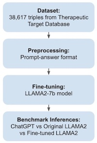
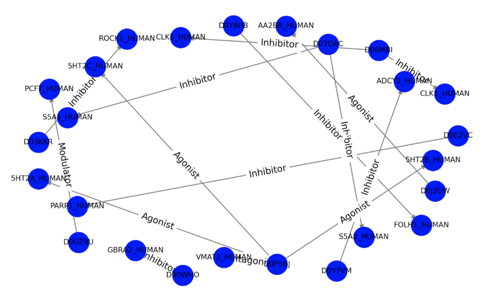
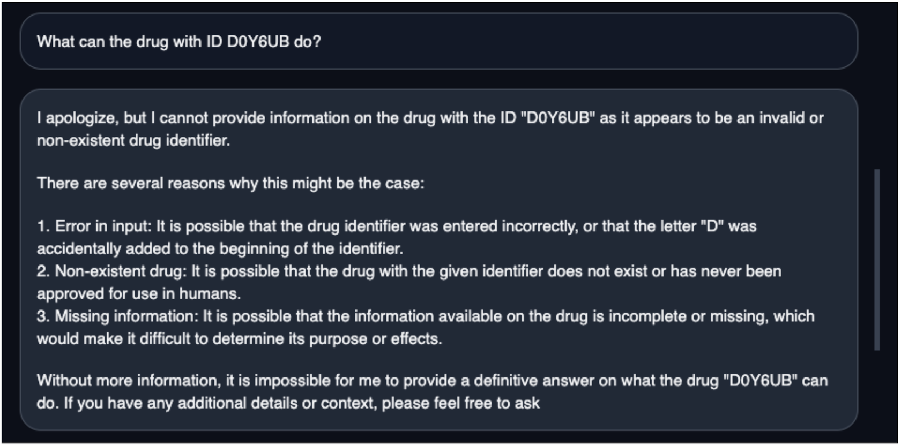
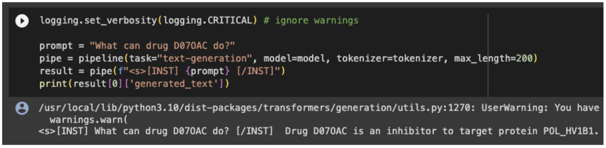

# Introduction

In October 2023, a group of 44 scientists hailing from several U.S. states, Canada, Poland, and Switzerland came together for a hybrid in-person and virtual hackathon. The event was jointly hosted by Carnegie Mellon University Libraries and DNAnexus, a California-based cloud computing and bioinformatics company. This collaborative effort revolved around the theme of “Data Management and Graph Extraction for Large Transformer Models in the Biomedical Space.” In the spirit of fostering collaboration, participants organized themselves into five teams, which ultimately resulted in the successful completion of four hackathon projects. These projects encompassed a wide range of topics, from detecting features contributing to virus susceptibility to validating models using knowledge graphs. Repositories for the hackathon projects are available at https://github.com/collaborativebioinformatics. We hope that the insights and experiences shared by these teams, as detailed in the following manuscript, will prove valuable to the broader scientific community. 

## Code Availability:

Virus Susceptibility: https://github.com/collaborativebioinformatics/virussusceptibility

Graph Based Tuning: https://github.com/collaborativebioinformatics/graphbasedtuning 

VCFs to Knowledge Graphs: https://github.com/collaborativebioinformatics/vcfs2kgs

Knowledge Graph Based Validation: https://github.com/collaborativebioinformatics/kgbasedvalidation

## Virus Susceptibility

The COVID-19 pandemic has generated a substantial body of scientific literature, prompting innovative approaches to address complex questions surrounding the disease [@wang_text_2021]. The Virus Susceptibility team employed vector comparison inferences to identify correlations between COVID-19 susceptibility and chronic diseases (e.g., cancer, hypertension, or diabetes). To enhance our search capabilities for relevant articles, we constructed vector databases using the CORD-19 dataset [@wang_cord-19_2020], These databases brought significant improvements in performance, scalability, and flexibility in searching for relevant articles using certain queries (https://www.pinecone.io/learn/vector-database/; https://learn.microsoft.com/en-us/semantic-kernel/memories/vector-db). We tested our pipeline on both a subset of the CORD-19 dataset as well as on the entire dataset. Furthermore, we extended our efforts by creating a custom vector database using 40 articles within the CORD-19 dataset. These articles were processed using SPECTER, and we conducted subsequent tests to evaluate the retrieval capabilities of the corresponding articles.

## Graph-Based Tuning

As large language models (LLMs) continue to improve in speed and accuracy, their applications in the biomedical field are becoming increasingly valuable. For instance, LLMs can be used in drug treatment recommendations for various diseases where time and precision are paramount [@thirunavukarasu_large_2023]. Additionally, empirical evidence shows that LLMs consistently outperform smaller language models in various complex and contextual tasks [@wei_emergent_2022]. However, for LLMs to provide accurate drug treatment recommendations, they must be trained on factually correct and updated training data, which often does not occur. Furthermore, it is also crucial for LLMs to answer queries based on given context [@chang_survey_2023], especially when taking into consideration scientific articles on precision medicine that often contain critical subtleties. Knowledge Graphs (KGs) have emerged as state-of-the-art methods for capturing relationships between data points, offering a means to supply LLMs with contextually relevant knowledge [@yasunaga_qa-gnn_2022]. Hence, an LLM fine-tuned on a KG can be given the ability to answer complex biomedical queries, addressing the above issues. Therefore, we believe that fine-tuning an LLM with knowledge graphs related to biomedicine can improve its ability in recommending drug treatment. In our experiments, we fine-tuned the Llama 2 model [@touvron_llama_2023] and benchmarked it against ChatGPT and the original Llama 2 models using medical queries. Our fine-tuned LLAMA2Glendalorian model is deployed on HuggingFace (llama-2-7b-glendalorian)[https://huggingface.co/tminh/llama-2-7b-glendalorian].

## VCFs to Knowledge Graphs

As the field of medical knowledge continues to expand, clinicians are faced with the challenge of effectively integrating this wealth of information into the context of individual patient care. To fully harness the growing medical knowledge base for the benefit of patients, it is imperative that we find ways to represent existing biomedical knowledge alongside individual patient data. Previous efforts to integrate such knowledge have generally been limited to patients who have known  mutations within a selected subset of genes [@zhao_po2rdf_2022]. Typically, the entire genetic profile of a patient is not taken into consideration, thereby limiting our ability to uncover novel therapeutic avenues. For example, if a patient carries a mutation in the EGFR gene, even though their tumor type doesn’t typically exhibit EGFR mutations, conventional clinical practice may overlook sequencing the EGFR gene to detect this mutation. Consequently, treatment options may not include drugs that have proven effective for patients with known EGFR mutations. 

In this component of the hackathon, we aimed to develop a proof-of-concept pipeline that is able to generate a clinical-genomic knowledge graph from cohort-based, large-scale genomics data (i.e., a VCF file or other genomic data storage format) and existing knowledge (e.g., clinical knowledge-bases or variant annotations). Enriching the graph in this way to make use of cohort-level information as well as more generalized knowledge from existing practice is the next step to ensuring precision medicine – that is, improving care for individual patients based on lessons that have been learned from previous patients.

For this proof-of-concept, we utilized the publicly-available TCGA COAD-CPTAC dataset previously described in Vasaikar et. al., 2019 [@vasaikar_proteogenomic_2019] which contains 110 patient samples with associated clinical data; 106 of the patient samples include corresponding sequencing data. This dataset was chosen due to its robust clinical-genomic links and its public availability. 

## Knowledge Graph Based Validation

At their core, knowledge graphs consist of nodes representing concepts and edges relating those concepts. An illustrative example of this is a knowledge graph mapping genes to their known disease associations. However, constructing knowledge graphs often involves aggregating information from a variety of sources, and verifying the accuracy of relationships within these graphs against continually evolving knowledge can pose challenges.

In the Knowledge Graph Based Validation project, we aimed to explore the applicability of large language models (LLMs) beyond general domains. Specifically, we sought to assess these capabilities of LLMs in three key areas: 1) understanding biomedical domain knowledge from research publications, 2) constructing knowledge graphs in formats such as Resource Description Format (RDF), and 3) comparing and validating inputs and relationships within knowledge graphs. To achieve this, we leveraged existing research publications such as PubMed to validate and identify relationships within these knowledge graphs using LLMs. Specifically, we sought to test whether large language models (LLMs) such as Vicuna, LLama2, or GPT-4 might offer a viable path to validating relationships within knowledge graphs. Our approach is novel in that we devised and implemented a structured way to pass in existing knowledge from the literature into LLMs, obtain parsed relationships, and compare these relationships to existing knowledge graphs and the relationships thereof to validate them.

# Flow diagrams

## Virus Susceptibility

\
**Figure 1.** Virus Susceptibility workflow.

## Graph Based Tuning

\
**Figure 2.** Graph Based Tuning workflow.

## VCFs to Knowledge Graphs

\
**Figure 3.** VCFs to Knowledge Graphs workflow.

## Knowledge Graph Based Validation

\
**Figure 4.** Knowledge Graph Based Validation workflow.

# Methods

## Virus Susceptibility

The Jupyter notebooks used in this work are located in the scripts/ directory on the project GitHub page (https://github.com/collaborativebioinformatics/virussusceptibility).
The CORD-19 dataset [@wang_cord-19_2020] contains metadata and embeddings that are generated from Covid-19-related articles. We retrieved the embeddings with references to the original articles from the dataset. The embeddings were generated with SPECTER (Scientific Paper Embeddings using Citation-informed TransformERs) [@cohan_specter_2020], which is a pre-trained language model that can be used to generate high-quality article representations. The training of the model and its implementation details can be found in the original article [@cohan_specter_2020]. We created a vector database with 'insert', 'query', and 'retrieve' methods (https://www.linkedin.com/pulse/vector-databases-demystified-part-2-building-your-own-adie-kaye/). Then, we inserted the CORD-19 embedding into the vector database.
We downloaded SPECTER from GitHub (https://github.com/allenai/specter) and used it to create an embedding for an example query (specifically, "What combinations of features predispose cohorts to virus susceptibility?"). Next, we compared the embedding of the example query with all of the embeddings in the dataset and ranked the comparisons according to cosine similarity. Thus, the highest-ranked paper retrieved should be the closest contextual match to the example query (i.e., the highest ranked paper should have the highest measure of cosine similarity).
Remark: Cosine similarity turned out to be unsuitable for high-dimensional vector comparison. For this reason we reduced the dimensionality of vectors with random projection (http://people.ee.duke.edu/{\textasciitilde}lcarin/p93.pdf; https://towardsdatascience.com/random-projection-in-python-705883a19e48); specifically, Gaussian random projection (https://scikit-learn.org/stable/modules/generate/sklearn.random\_projection.{GaussianRandomProjection}.html). Then, we used cosine similarity to search for articles that showed  the highest relevance with respect to the query.
As a proof of principle, we created a dataset of ten articles and embedded the articles SPECTER [@cohan_specter_2020]. The embeddings were subsequently inserted into a vector database. Lastly, we tested the retrieval of the most relevant articles. The corresponding workflow is provided on the project GitHub page (https://github.com/collaborativebioinformatics/virussusceptibility/scripts/query_custom_dataset.ipynb).

## Graph Based Tuning
Firstly, 38,617 drug-relationship-target triples were downloaded from the Therapeutic Target Database [@zhou_ttd_2023]. A knowledge graph was generated from 20 sample triples and is shown in **Figure 5**. Then, we developed an algorithm to preprocess such triplets into a prompt-response format for LLAMA2 (see “inputdata.txt”). For instance, a sample prompt would be “[INST] Tell me more about the drug with ID D07OAC. [/INST]” and its corresponding response would be “Drug D07OAC is an inhibitor to target protein S5A2_HUMAN.”

\
**Figure 5.** Knowledge graph generated from 20 sample triples.

Traditional fine-tuning approaches generally require retraining the last layers of the LLM, which is computationally-expensive. To overcome this, we leveraged QLora [@dettmers_qlora_2023], an efficient parameter tuning method that uses Low Rank Adaptation and Double Quantization to reduce training and inference costs. The Llama 2-7b [@touvron_llama_2023] model was fine-tuned on the preprocessed data for three epochs. Training was done on a NVIDIA Tesla A100 and training time was approximately three hours. Our fine-tuned model LLAMA2Glendalorian has been deployed on HuggingFace (https://huggingface.co/tminh/llama-2-7b-glendalorian). Finally, our fine-tuned model was benchmarked against ChatGPT (https://chat.openai.com) and the original Llama 2 model using the prompt “What can the drug with ID D0Y6UB do?”. The results are shown in the results section.

## VCFs to Knowledge Graphs

We first acquired data from the TCGA COAD-CPTAC dataset, mentioned above and previously described in Vasaikar et. al., 2019 [@vasaikar_proteogenomic_2019]. This dataset consists of a MAF file (pre-converted from a VCF file) that provides data about subjects, the genetic variants they carry, and various annotations for those variants including: what genes they mapped to, the functional impact of those variants, and ClinVar annotations for variants that had a known clinical impact. 

To ensure data harmonization, especially when dealing with the potential integration of data across cohorts (although not implemented in this instance, but is feasible within this framework), we obtained MONDO concepts for various diseases from the MONDO database. Similarly,  we acquired HUGO concepts for each gene. This approach enabled us to establish a unified representation for genes and diseases across various cohorts, addressing potential heterogeneity issues that are most likely to emerge across nodes in the graph between cohorts and where harmonization is critical.

To reduce the number of variants included within the dataset as a proof-of-concept, we filtered the genes contained within the graph to only include those with ClinVar-annotated variants across the entire cohort. However, the same framework can be applied without this filtering step to substantially enrich the graph and enable possible link prediction and inference tasks (of which genes may be associated with disease, for example). The code to implement this is included in the repository (https://github.com/collaborativebioinformatics/vcfs2kgs) as a Python notebook `tcga_rdf.ipynb` that can be run directly so long as the data is downloaded and provided, and a BioPortal API key is acquired (which can be done for free).

## Knowledge Graph Based Validation

We accomplished evaluation of the LLMs by constructing an induced subset of an existing knowledge base known as DisGeNet, which is structured in a relational form as a knowledge graph. The induced subset consisted of three single nucleotide polymorphisms (SNP, aka variants) and the diseases associated with those variants, and it comprised the set of SNPs for which we tested this approach.

For each SNP, we acquired a body of literature from PubMed by using the SNP name as a keyword for a PubMed search. The abstracts from the papers obtained were provided for each SNP to the model and the model was prompted to construct subject-predicate-object triplets from these abstracts. We evaluated this approach on multiple open-source or publicly available LLMs, including Vicuna-7b, Vicuna-13b, llama2-7b, codellama2-7b, and GPT-4. We used three overarching prompts for each of these models:

Prompt 1: “User: Create subject predicate subject logic triplets using some motor vehicles and output it as a subject predicate subject logic triplet. An example subject predicate subject triplet could be Biliary Atresia - results in - biliary obstruction. Create 10 of these triplets.”

Prompt 2: “User: Create subject predicate subject logic triplets using some genes and their disease associations and output it as a subject predicate subject logic triplet. An example subject predicate subject triplet could be Biliary Atresia - results in - biliary obstruction. Create 10 of these triplets.”

Prompt 3: “Create subject predicate subject logic triplets using singlue nucleotide polymorphism rs rs113993960 and their disease associations and output it as a subject predicate subject logic triplet. An example subject predicate subject triplet could be Biliary Atresia - results in - biliary obstruction. Create10 of these triplets.”

We then compared the results of these models to the DisGeNet associations. The code for all of these can be found in the repository (https://github.com/collaborativebioinformatics/kgbasedvalidation/) with documentation in the repository describing the required dependencies and installation instructions. 

# Discussion and/or Conclusion

## Virus Susceptibility

Building and querying the vector database that was previously created using the embeddings from the CORD-19 dataset didn't show the expected result (articles related to the topic of the query). This highlights a possibility for improvement in data and code reproducibility. Building our own custom vector database from the CORD-19 articles and querying it yields articles relevant to the query. Example results for a query “hypertension” show provided search results that included an article related to cardiovascular diseases. This result can be found on the GitHub page. Querying the vector database with the embedded query takes only ~190 ms.
## Graph Based Tuning

The results show that neither ChatGPT nor the original Llama model 2 were able to relate specific drug (ID: D0Y6UB) to the target protein (see **Figures 6 and 7**), whereas our LLAMA2Glendalorian model suggested a putative target protein (POL_HV1B1) for the drug with the corresponding binding relationship (see **Figure 8**). In most of our experiments, the improvement from the 13B models over the 7B models indicates that use of larger models – or leveraging smaller models – is warranted for questions in the biomedical domain that were appropriate for deep learning models, such as those involving many-to-many comparisons and finding contextualised etiologies.  

\
**Figure 6.** Response from ChatGPT to the benchmark prompt.

\
 **Figure 7.** Response from the Llama 2 model to the benchmark prompt.

\
**Figure 8.** Response from the LLAMA2Glendalorian model to the benchmark prompt.

## VCFs to Knowledge Graphs

The underlying relationships within the graph were constructed based on cohort-specific relationships (for example, whether patients have colon adenocarcinoma or not) as well as information acquired from existing clinical knowledge bases. A schema of the ideal graph construction has been provided (see **Figure 9**), with dashed edges representing planned but not implemented (due to time constraints) relationships. Concepts contained within the graph constructed using this framework from the CPTAC dataset are shown below (see **Table 1**) below and embedded within **Figure 9**.

**Table 1.** Concepts for the graph construction. 

|   Concept   |   Name                                          |   Number |
|:-----------:|:-----------------------------------------------:|:--------:|
|   Node Type |   Sample                                        |   93     |
|   Node Type |   Gene                                          |   3302   |
|   Node Type |   Cancer Type                                   |   1      |
|  Edge Type  | isCancerTypeOf (connects Sample -> Cancer Type) |  93      |
|  Edge Type  | hasHugoSymbol (connects Sample -> Gene)         |  15285   |

\
**Figure 9.** A schema of an ideal graph construction.

## Knowledge Graph Based Validation

The single nucleotide polymorphisms/variants that we evaluated are shown below (see **Table 2**). These pairs were collected using the DisGeNET database, as described above. Some examples of the responses from the models tested are provided below in **Figure 10**. Notably, many of the prompts including the abstracts exceeded the recommended context window for some of these models, and we note that prompts approaching the context window recommendation or exceeding it tended to lead to substantially worse performance. 

 
**Table 2.** Evaluated SNPs.

| SNP             |                   Diseases                   |
|:---------------:|:--------------------------------------------:|
| rs113993960     | BRONCHIECTASIS                               |
| rs113993960     | Stenosis of duodenum                         |
| rs113993960     | Congenital bilateral aplasia of vas deferens |
| rs113993960     | Hereditary pancreatitis                      |
| rs113993960     | Recurrent pancreatitis                       |
| rs113993960     | Cystic Fibrosis                              |
| rs199473282     | LONG QT SYNDROME 3                           |
| rs199473282     | Brugada Syndrome (disorder)                  |
| rs199473282     | Brugada Syndrome 1                           |
| rs199473282     | Long QT Syndrome                             |
| rs199473282     | Hereditary bundle branch system defect       |
| rs121909211     | Plaque, Amyloid                              |
| rs121909211     | Familial Amyloid Polyneuropathy, Type V      |
| rs121909211     | Corneal dystrophy                            |
| rs121909211     | Corneal deposit                              |
| rs121909211     | Corneal Dystrophy, Lattice Type IIIA         |
| rs121909211     | Dystrophy, granular                          |
| rs121909211     | Reis-Bucklers' corneal dystrophy             |
| rs121909211     | Corneal guttata                              |
| rs121909211     | Lattice corneal dystrophy Type I             |
| rs121909211     | Amyloidosis                                  |
| rs121909211     | Neoplasms                                    |
| rs121909211     | Granular Dystrophy, Corneal                  |
| rs121909211     | Thiel-Behnke corneal dystrophy               |
| rs121909211     | Stromal Dystrophies, Corneal                 |
| rs121909211     | Avellino corneal dystrophy                   |

\
**Figure 10.** Outputs from the tested LLMs.

# Conclusion and Future Directions

The advent of large language models (LLMs) has provided a unique opportunity in the biomedical domain. LLMs have shown the capability in outputting code or file formats given natural language prompts, synthesising data, and extracting relevant information from corpus.  

## Future Directions for the Teams Involved in this Hackathon

## Virus Susceptibility

-	Create a vector database of 1M CORD-19 articles
-	Develop a more efficient method to generate queries for the vector database
-	Use the vector database to ask complex scientific questions:
-	"What combinations of features predispose cohorts to viral infections?"
-	"Which combinations differentially predispose individuals to chronic disease post infection?”

## Graph Based Tuning

-	Fine-tune LLMs onto additional biomedical KGs:
-	DrugBank/ROBOKOP 
-	Protein-protein interactions
-	Drug-drug interactions

## VCFs to Knowledge Graphs

-	Construct sample-sample edges from a genetic relatedness matrix, automatically identifying duplicates and related individuals across cohorts
-	Create disease-disease edges based on co-occurrence and different levels of granularity
-	Include gene-disease edges from DisGeNet
-	Include additional node attributes, e.g.: original cohort, sex, age on the sample level; or gene type (protein-coding, noncoding, pseudogene) on the gene level

## Knowledge Graph Based Validation

-	Compress prompts by summarizing abstracts further to reach context windows
-	Create an end-to-end pipeline using DisGeNET
-	Implement dynamic parameter tuning and queryable database formatting
-	Implement data structures for comparing SPO objects: 
-	Q/A implement comparison of data structures 
-	Implement key word predicates to limit the scope of keywords

If you or your colleagues are interested in collaborating on these or similar projects in a hackathon or professional setting, please contact ben.busby@gmail.com. If you have technical questions or issues, please put an issue into one of the github repositories listed below.  

# Data and software availability

All code is provided in the following GitHub repositories, which may include additional links to data repositories and Jupyter Notebooks.

-	https://github.com/collaborativebioinformatics/virustrajectory
-	https://github.com/collaborativebioinformatics/graphbasedtuning
-	https://github.com/collaborativebioinformatics/vcfs2kgs
-	https://github.com/collaborativebioinformatics/kgbasedvalidation

# Acknowledgements

## Carnegie Mellon Libraries

For providing space – in both Pittsburgh, PA and Palo Alto, CA – as well as refreshments and other logistical support. The authors would especially like to thank Tom Hughes, Melanie Gainey, and Leigh Mason.

## DNAnexus

Thanks to DNAnexus for providing computing resources for the Hackathon, as well as the time of BB and CL.  

## Grant funding

Van Q. Truong is supported by the Microsoft Research PhD Fellowship and ACM SIGHPC Computational and Data Science Fellowship. Rachit Kumar is supported by the Training Program in Computational Genomics grant from the National Human Genome Research Institute to the University of Pennsylvania under award number T32HG000046.

# References

